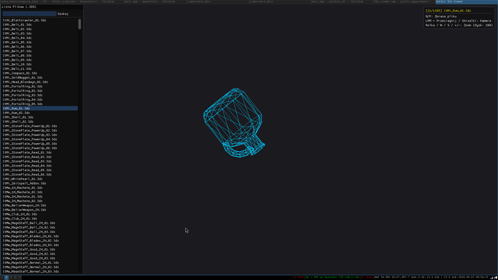
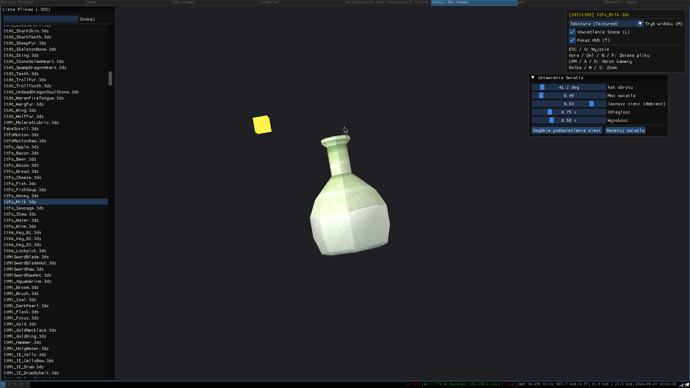
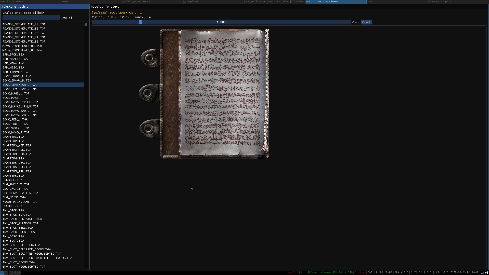

# gothic_experiments

Simple C++ applications to explore the Gothic world, lights, meshes and 3DS files using OpenGL.

For simple testing, simple ZEN worlds are attached:
- `Helms Hammer.ZEN`
- `TOTENINSEL.ZEN`

Downloads:
- https://www.worldofgothic.de/?go=moddb&action=view&fileID=742&cat=18&page=1&order=0
- https://www.worldofgothic.de/?go=moddb&action=view&fileID=994&cat=18

## Applications

### 3ds_viewer

Shows Gothic 3DS files and textures.

### list_lights

Lists light sources from a ZEN file.
