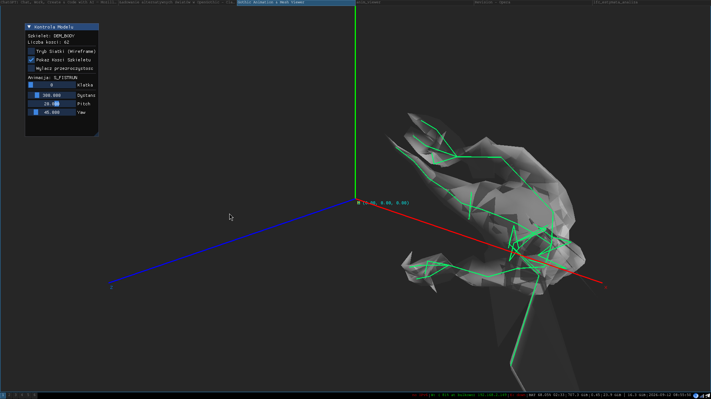

# gothic_experiments

Simple C++ applications to explore the Gothic world, lights, meshes and 3DS files using OpenGL.

For simple testing, simple ZEN worlds are attached:
- `Helms Hammer.ZEN`
- `TOTENINSEL.ZEN`

Downloads:
- https://www.worldofgothic.de/?go=moddb&action=view&fileID=742&cat=18&page=1&order=0
- https://www.worldofgothic.de/?go=moddb&action=view&fileID=994&cat=18

## Applications

### 3ds_viewer

Shows Gothic 3DS files and textures.

### list_lights

Lists light sources from a ZEN file.

### anim_viewer

Loads a Gothic character model (mesh + skeleton + animation) via ZenKit and plays back its animations with proper skeletal skinning, rendered using OpenGL.

**Usage:**
./anim_viewer [MODEL_NAME] [GOTHIC_DIRECTORY]
./animviewer DEMON

- `MODEL_NAME` – name of the model to load (default: `DEMON`)
- `GOTHIC_DIRECTORY` – path to the Gothic II installation (default: hardcoded Wine path)

**Features:**
- Skeletal animation playback with per-frame scrubbing
- Correct linear-blend skinning based on ZenKit's per-weight local bone positions
- Skeleton (bone) overlay rendering
- Wireframe toggle
- Toggle to disable mesh transparency
- Orbit camera (distance / pitch / yaw sliders, mouse-driven)

